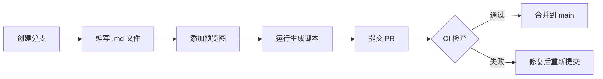

# Contributing — 风格协作指南

欢迎贡献风格提示词！本文档说明如何通过 PR 提交新风格。

## ⚡ 快速流程

```bash
# 1. 创建分支
git checkout -b feat/my-new-style

# 2. 创建风格文件
touch styles/分类/my_style_name.md

# 3. 生成数据 + 画廊
python3 scripts/generate_data.py
python3 scripts/build_gallery.py

# 4. 提交
git add -A
git commit -m "feat: add my_style_name (#N)"
git push origin feat/my-new-style
```

## 分支命名

| 分支类型 | 前缀 | 示例 |
|----------|------|------|
| 新风格 | `feat/` | `feat/cyberpunk_portrait` |
| 修复 | `fix/` | `fix/missing_field_in_x` |
| 文档 | `docs/` | `docs/update_readme` |

## 风格文件规范

### 文件路径

```
styles/分类/风格名.md
```

### 分类目录

| 目录 | 说明 |
|------|------|
| `social_media` | 社交媒体/短视频 |
| `brand_kv` | 品牌主视觉/海报 |
| `e-commerce` | 电商/产品展示 |
| `science` | 科普/数据可视化 |
| `print` | 印刷品/杂志 |
| `ip_character` | IP角色/盲盒 |
| `travel` | 旅行/目的地 |
| `fashion` | 时尚/穿搭 |
| `creative` | 创意/实验性 |
| `vigo_cookbook` | Vigo食谱风格 |

### 文件名规则

- 小写字母 + 下划线：`my_style_name.md`
- 不超过 60 个字符
- 不要用空格、连字符、大写

### 必填字段

```markdown
# 风格名称

> 一句话简介

**来源**：作者名（平台）  
**链接**：原始链接  
**标签**：#标签1 #标签2 #标签3  
**触发词**：关键词1、关键词2  
**适用场景**：场景描述  
**比例**：宽高比（如 3:4, 16:9）

---

## 一句话理解

简洁的描述，一句话概括风格精髓。

---

## 核心特点

- 特点 1
- 特点 2
- 特点 3

---

## 完整模板

```
在这里写模板提示词
```

---

## 变量使用指南

| KV变量 | 模板变量 | 说明 |
|--------|----------|------|
| 画面-主体 | 主体描述 | 主要描述内容 |

---

## 参考配图


```

可选字段：

```markdown
**来源链接**：原始推文/页面链接（可选）
```

### 参考配图

- 将预览图放入 `images/styles_previews/`
- 命名格式：`{style_id}_{md5[:8]}.{ext}`
- 可使用 `python3 scripts/upload_preview.py` 自动处理

## PR 提交流程



### PR 前必做

```bash
# 1. 格式验证
python3 scripts/validate_all.py

# 2. 查重检测
python3 scripts/check_duplicate.py

# 3. 重新生成数据 + 画廊
python3 scripts/generate_data.py
python3 scripts/build_gallery.py
```

### PR 注意事项

1. **CI 必须通过** — 状态检查 `Validate styles` 必须绿
2. **生成文件必须提交** — `data/styles.json` 和 `gallery.html` 的变更要包含在 PR 中
3. **不自动更新画廊** — 收集提示词时不更新画廊页面，等用户明确要求

## CI 工作流

| 工作流 | 触发时机 | 做什么 |
|--------|----------|--------|
| `on-push-styles.yml` | PR 提交/更新 | 格式验证 + 查重 + 图片可达性 |
| `on-merge-main.yml` | PR 合并到 main | 重新验证 + 一致性检查 |
| `manual-deploy.yml` | 手动触发 | 验证 + 一致性检查 |

> ⚠️ 注意：CI 不自动推送生成文件到 main。每次 PR 必须自己运行生成脚本并提交变更。

## 风格编号

每个风格有固定编号：`ST000001`、`ST000002`…

- 编号由文件遍历顺序决定，不随删除/插入改变
- 可在画廊页面点击编号复制

## 快速参考

```bash
# 验证单个文件
python3 scripts/validate_style.py styles/分类/文件.md

# 验证全部文件
python3 scripts/validate_all.py

# 查重
python3 scripts/check_duplicate.py

# 生成 JSON 数据
python3 scripts/generate_data.py

# 生成画廊页面
python3 scripts/build_gallery.py

# 生成索引
python3 scripts/generate_index.py
```

## 有其他问题？

查看 `STYLE_GALLERY_COLLAB.md` 获取完整方案文档。
